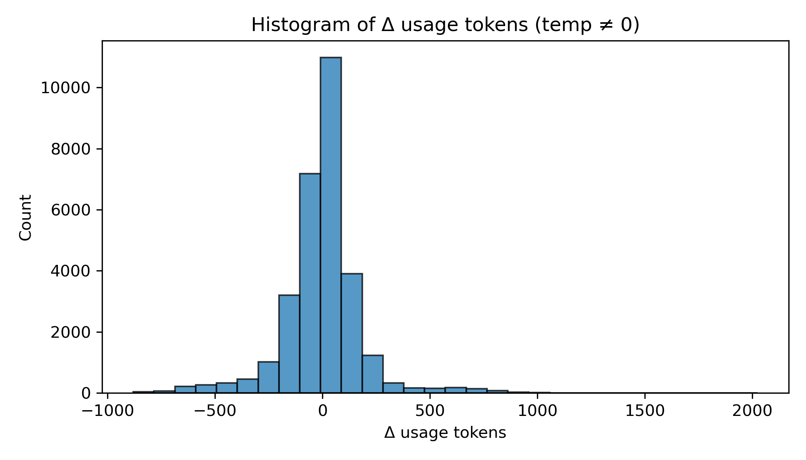

# Temperature Experiment Report

This report summarizes the effect of temperature on token usage for the experiment stored in `results_temperature_experiment_v2.csv`.

## Raw Token‑Usage Statistics by Temperature

|   temperature |   Mean (tokens) |   Std (tokens) |
|--------------:|----------------:|---------------:|
|           0   |         534.291 |        280.155 |
|           0.2 |         530.63  |        277.942 |
|           0.4 |         535.577 |        277.074 |
|           0.6 |         533.973 |        270.563 |
|           0.8 |         540.675 |        269.373 |
|           1   |         537.099 |        268.28  |
|           1.2 |         533.401 |        263.439 |
|           1.4 |         532.768 |        263.404 |
|           1.6 |         524.866 |        259.892 |
|           1.8 |         518.234 |        257.689 |
|           2   |         517.2   |        257.602 |

---

## Δ (Delta) Token‑Usage Statistics by Temperature

|   temperature |     Mean Δ |   Std Δ |
|--------------:|-----------:|--------:|
|           0   |   0        |   0     |
|           0.2 |  -3.66028  | 144.545 |
|           0.4 |   1.28617  | 155.605 |
|           0.6 |  -0.31773  | 165.152 |
|           0.8 |   6.3844   | 178.476 |
|           1   |   2.8078   | 191.071 |
|           1.2 |  -0.889362 | 195.845 |
|           1.4 |  -1.46842  | 199.781 |
|           1.6 |  -8.87643  | 200.392 |
|           1.8 | -15.5093   | 209.047 |
|           2   | -16.5425   | 216.161 |

---

### Spearman Correlation between **temperature** and **usage tokens**: **-0.0343**

A positive value indicates that higher temperatures tend to increase token usage.

## Δ Token‑Usage Histogram (temp ≠ 0)

